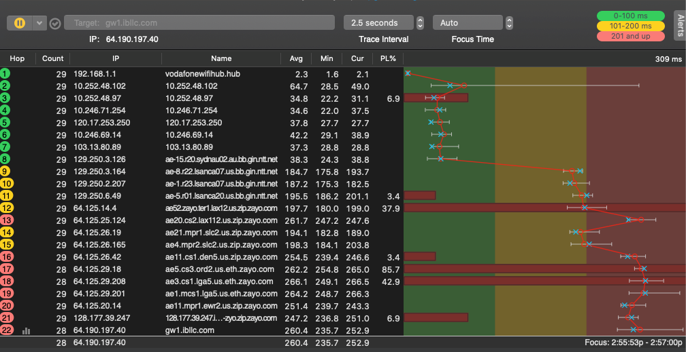
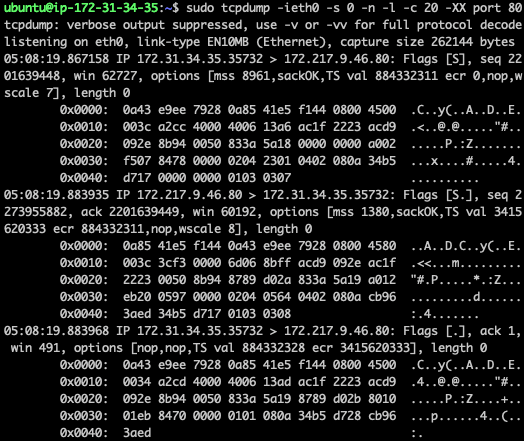

# Network monitoring and security testing exercises

The exercises presented below require the following network tools:
- `ifconfig`
- `varp`
- `ping`
- `traceroute`
- `tcpdump`
- `lynx`
- `nmap`

Some of these tools are preinstalled on many Linux systems. In case one of the tools is missing on your system, you could easily install it by using the Ubuntu package manger apt. For example, to install the text web browser *lynx*, run:

````
sudo apt install lynx
````

## Exercise 1

1.	Run the command-line command: `ifconfig`
2.	Locate physical addresses of all devices. 
3.	Why the network adapter identified by `lo`, does not have a physical address?

## Exercise 2

1.	Run the command-line command: `arp -a`
2.	Do any of the physical addresses match physical addresses of the devices shown by ifconfig? In yes/no, then why?

## Exercise 3

1. Run: `ping gw1.ibllc.com`
2. What is the IP address of the destination host?
3. Run: `ping 8.8.8.8`
4. Note that there is a variation in the field “time”. What could be the reason?
5. Run: `ping -t 20 gw1.ibllc.com`, incrementing the `-t` parameter from 20 to 30, with step 1. The goal is to employ ping command to identify the number of hops it takes for a packet to reach the destination. 
6. Run `ping anu.edu.au`
7. What could be the reason for either not getting anything printed or to get a Request timeout?

## Exercise 4
1. Run: `traceroute gw1.ibllc.com`
2. Over how many hops does the packet have to travel?
3. Compare:
```` 
traceroute -I anu.edu.au
````
and
````
traceroute anu.edu.au
````
The former command relays on ICMP packets and the latter one uses Transport layer (SYN packets) to trace the route.
4. A visual analog of traceroute is https://www.pingplotter.com/download/ Try it as a homework exercise.

 
## Exercise 5

1. Open a web-browser of your choice
2. Type http://172.217.167.78 <enter> 
3. Type http://172.217.167.78:80  <enter> 
4. Type http://google.com <enter>
5. Type http://google.com:80 <enter>
6. Type http://google.com:81 <enter>
7. Explain why in 2-5 the page has loaded up, but not in 6.

## Exercise 6

1. Open two simultaneous connections to AWS (or open two terminals if you run Linux on your machine).
2. Run: `man tcpdump` and investigate what each of the parameters in following command mean: 
````
tcpdump -ieth0 -s 0 -n -l -c 20 -XX port 80
````
3. Run: `tcpdump -ieth0 -s 0 -n -l -c 20 -XX port 80`
4. In the other terminal run: `lynx google.com`
5. Switch back to the first terminal, you should see a similar to this output

6. Locate an IP header of the first packet and investigate its fields.
7. Locate a TCP header of the fist packet and investigate its fields.

## Exercise 7

1. Run: `man nmap` and investigate what each of the parameters in following command do:
````
nmap -v -A scanme.nmap.org 
````
2. Run: `nmap -v -A scanme.nmap.org`
3. Study the output of the command above. What is the IP address of the destination host? What ports are opened at the destination host?
4. Does it run a webserver and if does what is its version?
