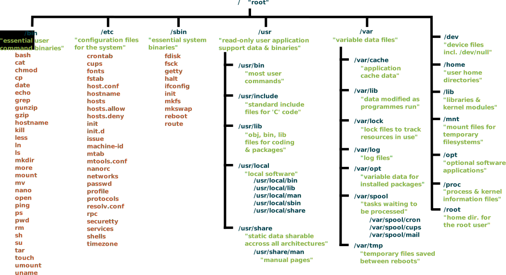

# Think Like a Hacker
## Unix System Basics

<a href="https://villains.fandom.com/wiki/Boris_Badenov"></a>

Unix-like operating systems like Android, Linux, and macOS are used on the vast majority of computers worldwide, from phones and laptop computers to company servers, and virtually all high-performance computing systems. Because of this, Unix systems have become major targets for bad actors seeking to steal information or money, or damage infrastructure.

So what is Unix? How does it work? and how can we protect it against the bad guys? To defend our systems, we first need to understand some basics of Unix-like operating systems, and we're also going to need to start thinking like a hacker.

## Secure Shell - SSH

Let's start at the front door. If you have an account on a Unix system, the [Secure Shell (SSH)](https://www.ssh.com/ssh/) protocol allows you to log in, transfer data, and execute commands on that system.

### SSH Clients

MacOS and Linux operating systems have SSH clients built in, so you don't need to install any extra software. 

For Windows, [PuTTY](https://www.putty.org/) is a fully-featured open-source SSH client. You can also [install the Windows Subsystem for Linux](https://docs.microsoft.com/en-us/windows/wsl/install-win10) which provides a complete installation of Ubuntu Linux inside your Windows system; WSL also comes with an installation of the OpenSSH client.

You can install [Google's Secure Shell App plugin for the Chrome browser](https://chrome.google.com/webstore/detail/secure-shell-app/pnhechapfaindjhompbnflcldabbghjo?hl=en) to run a SSH client inside Chrome.

**Think About It** Should you install one of the software packages above? How can you decide whether to trust software you find on the Internet?

### Logging in using SSH

If you want to find a computer system, you need to know either its name or address. Every computer has a unique address within its network; it may also have a unique IP address that can be accessed from any other computer on the Internet.

With an SSH client, you can use the IP address to specify which computer you'd like to connect to, for example:

````
ssh username@150.203.24.13
````

If the computer has a host name, such as a [domain name](https://en.wikipedia.org/wiki/Domain_Name_System) on the Internet, you can also use its name to connect, for example:

````
ssh username@partch.anu.edu.au
````

Computers listen to the network over multiple ports. [Commonly used ports](https://web.mit.edu/rhel-doc/4/RH-DOCS/rhel-sg-en-4/ch-ports.html) include 80 (HTTP), 443 (HTTPS), and 22 (SSH). You can specify which port you'd like to connect to in Putty or in OpenSSH (via the `-p` option); the default is port 22.


## The Filesystem

Almost all resources in a Unix system can be accessed through the filesystem. This includes data files (text, images, video, etc.), programs, hardware devices, and system information.
The filesystem is organized into a tree of directories.
Most Unix systems use a standard set of directory names to help users navigate around.

 (source: [Wikimedia Commons](https://commons.wikimedia.org/wiki/File:Standard-unix-filesystem-hierarchy.svg))

Filenames are case-sensitive and unique within a directory. Filenames do not usually contain [spaces or other special characters](https://www.tecmint.com/manage-linux-filenames-with-special-characters/) as this can make them hard to deal with.
If a filename starts with `.` it is a [hidden file](http://www.linfo.org/hidden_file.html), requiring special effort to see or manipulate.

## The Shell

The shell is what you're interacting with at the command prompt.
It interprets and executes the commands you type, such as executing programs.
There are many different shells; some of the most popular are [bash](https://linux.die.net/man/1/bash) and [csh](https://linux.die.net/man/1/csh).
Each shell features a scripting language which is a complete programming language for automating tasks on the command line.
You can find out which shell you're currently running with the following command:

````
echo $SHELL
````

## System Tools

There are a huge array of different programs that let you read and manipulate files and other system resources.
Unix system tools are usually simple modules that can be combined together in a vast number of ways.
Some of the most frequently used tools are:

- [echo](https://linux.die.net/man/1/echo) echos whatever input is it given to 'standard output', which is displayed on the terminal
- [pwd](http://man7.org/linux/man-pages/man1/pwd.1.html) prints the name of the current directory
- [ls](http://man7.org/linux/man-pages/man1/ls.1.html) lists the contents of a directory
- [file](https://linux.die.net/man/1/file) tells you the type of a file i.e. what kind of data it contains
- [cat](http://man7.org/linux/man-pages/man1/cat.1.html) prints the contents of a file to standard output
- [less](http://man7.org/linux/man-pages/man1/less.1.html) lets you read the contents of a file one page at a time
- [find](http://man7.org/linux/man-pages/man1/find.1.html) searches for files in a directory
- [grep](http://man7.org/linux/man-pages/man1/grep.1p.html) searches for patterns within files
- [sort](http://man7.org/linux/man-pages/man1/sort.1.html) sorts values in a file and prints to standard output
- [uniq](http://man7.org/linux/man-pages/man1/uniq.1.html) filters out matching lines from a file
- [xxd](https://linux.die.net/man/1/xxd) make a hexadecimal dump of a file
- [tr](http://man7.org/linux/man-pages/man1/tr.1p.html) substitutes or deletes characters from input, copying to output
- [man](http://man7.org/linux/man-pages/man1/man.1.html) probably the most important - the manual! Tells you how to use all the other programs. In these modern times you can also [google the manual page for a command](https://www.google.com/search?q=man+ls)

## Access and Authentication

Most computer systems support multiple users. On a Unix system these can be regular users -- which usually correspond to real people -- or [system users](http://www.linuxfromscratch.org/blfs/view/svn/postlfs/users.html), which are special accounts that run important processes to maintain bits of the system.

To log in to the system as a regular user, you must first be authenticated. This means you provide one or more pieces of information that the system can use to identify you as the person who owns the user account. Some methods for authentication include:
- password - a secret token that is stored (encrypted) on the system against your user account
- [public key authentication](https://www.ssh.com/ssh/putty/putty-manuals/0.68/Chapter8.html), in which you create a matching pair of public and private keys, and give the server the public key. The server can later ask you to prove that you hold the private key by asking your system (SSH client) to decrypt a message that was encrypted with the public key.
- two-factor authentication: for example, entering a time-bound password generated by a smart key card
- biometric authentication e.g. face or retinal scan
- network authentication, where you prove your identity to another trusted computer which can then identify you to the target system

Each user has a unique username and uid (user id), and is a member of one or more groups.

Access to system resources like files, directories, or executable programs is granted to users and groups. There is one user called `root` which has access to all resources on the system; this power can also be given to certain users called 'superusers', who have access to two special commands:

- `su` allows a user to switch user to 'become' another user on the system, receiving all their access privileges
- `sudo` allows a user to perform a command using superuser privileges, which allows them to read and write data or execute programs to which they would not normally have access

### Permissions

Each file (or directory) is owned by a single user, and assigned to a group.
Permission is granted separately to *read*, *write*, or *execute* each file.
These permissions may be granted to either the owner of the file, the file's group, or all other users.

The permissions on each file may be displayed by `ls` using the long listing format, for example:

````
user@system:~$ ls -l
total 0
drwxr-xr-x 1 user admins 4096 May 21 21:35 mydir
-rw-r--r-- 1 user admins    0 May 21 21:34 plain.txt
````

The long listing shows a string of ten characters at the start of the line for each file.
The first character relates to the file type (`d` for a directory, `-` for an ordinary file).
The next nine characters are in three groups of three, corresponding to the three classes of user (owner, group, all others).
The example above shows a directory that can be read, written, and executed (entered) by the owner, but only read and executed by members of the group and other users; and a plain text file that can be read and written by the owner, but only read by other users.

## Thinking Like a Hacker

https://overthewire.org/wargames/bandit/

